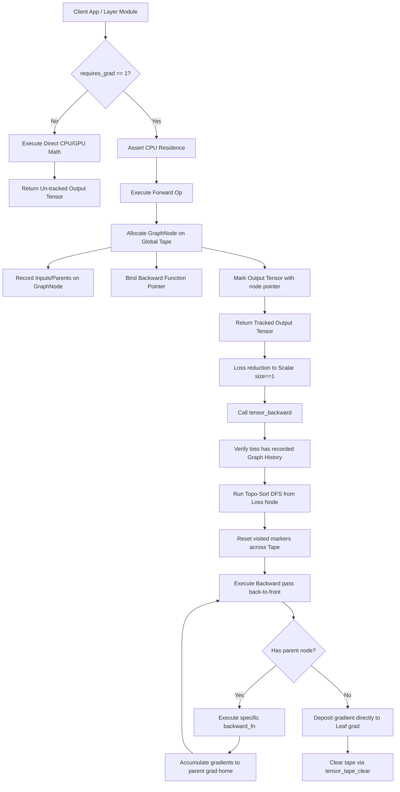
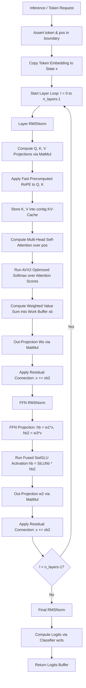
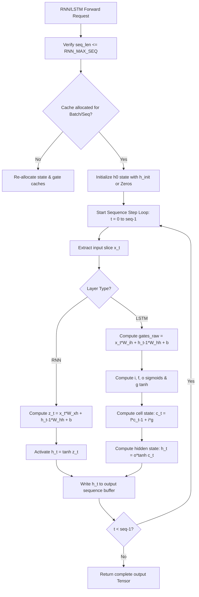
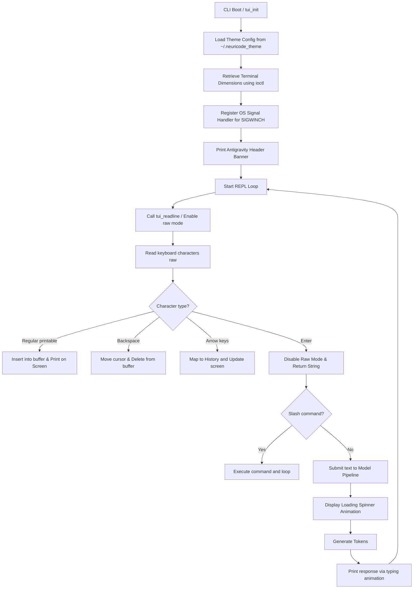
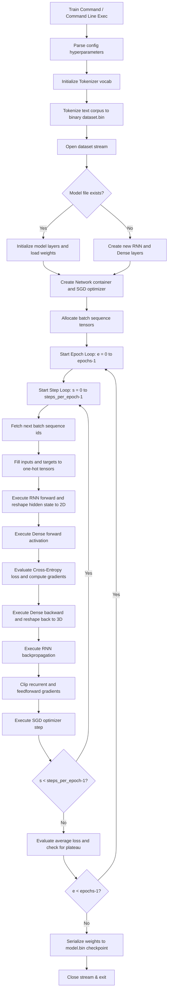

# SYSTEM_ARCHITECTURE.md
## Native Zero-Dependency Edge AI Engine in Pure C

---

## Module 1: Tensor Math & Autograd Engine

The `Tensor Math & Autograd Engine` provides the foundation for the entire framework, managing CPU memory structures, executing vectorized SIMD math operations, and tracking execution history dynamically using a reverse-mode autograd tape.

### 1. Architectural Flow

### 2. Line-by-Line Execution Breakdown

The implementation resides in `src/tensor.c` and header `include/tensor.h`.

| Block | Line Range | Technical Mechanism | Side Effects & State Changes |
|---|---|---|---|
| **Tape Allocation & Pushing** | 43–52 | Checks tape capacity (`g_tape_len == g_tape_cap`), doubles the capacity using `realloc()`, and appends the new `GraphNode*` to `g_tape`. Runs in $O(1)$ amortized time. | Modifies `g_tape`, `g_tape_len`, and `g_tape_cap`. May trigger memory reallocation. |
| **Node Instantiation** | 56–74 | Allocates memory for `GraphNode` and its `parents` array. Sets pointers to `output`, copies inputs, sets `backward_fn`, and registers the node in the output tensor. | Alters the output tensor's `node` pointer and sets `requires_grad = 1`. Appends to global tape. |
| **Gradient Home Resolution** | 80–82 | Resolves the tensor backing a view: returns `t` if `owns_data == 1`, otherwise returns `t->view_base`. Prevents orphaned views. | None (pure function). |
| **Effective Node Resolution** | 88–93 | Resolves the active `GraphNode` that produced a tensor, traversing view bases if `t` itself lacks a node pointer. | None (pure function). |
| **Gradient Accumulation** | 104–114 | Lazily allocates `t->grad` using `calloc` if NULL, then adds incoming gradients element-wise. Accelerates using OpenMP if elements > 4096. | Modifies `t->grad` buffer values. May allocate new heap memory. |
| **Topological Sorting** | 129–143 | Recursive Depth-First Search (DFS) post-order traversal starting at the loss node. Detects cycles by tracking temporary recursion stack markers (`visited == 1`). | Modifies `visited` fields on traversed tape nodes. Allocates temporary sorting array `order`. |
| **Backward Pass Drive** | 155–173 | Seeds the initial $dLoss/dLoss = 1.0f$ gradient, builds the reverse topological execution order via DFS, and executes the backward callbacks sequentially. | Modifies `grad` values across all nodes in the computational sub-graph. |
| **Add Op Backward Rule** | 185–190 | Downstreams incoming gradients unchanged: $d/da = grad\_out$ and $d/db = grad\_out$. | Accumulates gradients into parents' grad home. |
| **Sub Op Backward Rule** | 193–203 | Downstreams gradients directly to parent $A$, and negates the output gradient before accumulating into parent $B$. | Allocates temporary negated gradient buffer; modifies parent grads. |
| **Mul Op Backward Rule** | 206–220 | Calculates element-wise Hadamard gradients: $d/da = grad\_out \odot b$ and $d/db = grad\_out \odot a$. | Allocates two temporary buffers; modifies parent grads. |
| **MatMul Op Backward Rule** | 226–259 | Computes transpose multiplications: $d/da = grad\_out \times b^T$ and $d/db = a^T \times grad\_out$. Leverages OpenMP parallel for. | Allocates local memory for gradients `ga` and `gb`; modifies parent grads. |
| **Permute Op Backward Rule** | 265–281 | Wraps raw parent gradient buffers into non-owning temporary `Tensor` structures and runs `tensor_permute_backward` directly. | Maps output gradients back to input coordinates; modifies input grad home. |
| **Matrix Multiplication** | 566–670 | Executes tiled matrix multiplication with SIMD AVX2 and OpenMP row tiling if total FLOPs $\ge 4 \times 10^6$ and rows $\ge$ thread count. Falls back to scalar. | Fills the output tensor's `data` buffer. If tracked, instantiates a `GraphNode` with dimension metadata. |
| **Axis Permutation** | 803–885 | Computes multi-dimensional stride coordinates, maps elements back through `axis_order`, and populates a new contiguous output tensor. | Materializes a new `Tensor`. Tapes the operation if input `requires_grad == 1`. |

### 3. API / CLI Parameter Schema

| Parameter / Flag | Binary/Data Type | Optional/Required | Default | Description & Boundary Conditions |
|---|---|---|---|---|
| `shape` | `const int *` | Required | N/A | Array specifying size along each dimension. Max dimensions is `TENSOR_MAX_DIMS` (8). |
| `ndim` | `int` | Required | N/A | Dimensionality rank. Must satisfy $0 < ndim \le 8$. |
| `t` | `Tensor *` | Required | N/A | Pointer to target tensor. Must be non-NULL. |
| `requires_grad` | `int` | Required | N/A | Binary flag (0 or 1). Determines whether operations on this tensor should be tracked. |
| `axis` | `int` | Required | N/A | Target axis for reduction (0 = sum rows, 1 = sum columns). |
| `axis_order` | `const int *` | Required | N/A | Permutation array of size `ndim`. Must be a valid bijection of $[0, ndim-1]$. |

### 4. Failure Modes & Exception Matrix

| Trigger Condition | Internal Exception / Error Code | Stack Behavior | Recovery Strategy / Mitigation |
|---|---|---|---|
| Autograd attempted on GPU | `cforge_error` | Prints file & line, aborts process via `exit(1)`. | Force tensor back to host memory via `tensor_to_cpu()` prior to invoking the tracked op. |
| Computational Graph Cycle | `tensor_backward: cycle detected...` | DFS aborts, outputs detailed stack file location, halts process. | Inspect network execution tape; ensure no feedback loops exist where a tensor depends on its own downstream outputs. |
| Shape Mismatch in MatMul | `inner dimensions must match` | Aborts execution via `cforge_error` at line 572. | Validate input layer dimensions; ensure $K_{in} == K_{out}$. |
| Non-scalar loss backward | `loss must be a scalar tensor` | Aborts execution at line 147. | Apply reduction operations such as `tensor_sum()` or `tensor_mean()` to compile the loss down to size 1. |

---

## Module 2: Native Transformer Engine

The `Native Transformer Engine` represents a production-grade, decoder-only transformer block in C11. It incorporates custom alignment-aware allocations, precomputed Rotary Position Embeddings (RoPE), and highly optimized AVX2 kernels for memory prefetching, Softmax, and SwiGLU activation.

### 1. Architectural Flow

### 2. Line-by-Line Execution Breakdown

The implementation resides in `src/transformer.c` and header `include/transformer.h`.

| Block | Line Range | Technical Mechanism | Side Effects & State Changes |
|---|---|---|---|
| **RMSNorm Execution** | 63–80 | Calculates the root-mean-square over features, injects an epsilon of `1e-6f` for numerical stability, and scales using weights. | Overwrites output buffer `o`. Uses OpenMP reduction. |
| **Softmax Dispatcher** | 108–117 | Checks CPU capability at runtime using built-in features, routing to AVX2 polynomial-exp path or scalar reference. | Overwrites input logit values `x` with normalized probabilities. |
| **AVX2 MatMul Microkernel MR12** | 163–311 | Aggressive 12-row blocking with unrolled $K=16$ inner loop and `_mm256_fmadd_ps` FMA. Integrates `_MM_HINT_T0` software prefetching. | Overwrites output vector `xout`. |
| **AVX2 MatMul Microkernel MR4** | 314–425 | Conservative 4-row blocking for narrower instruction-level parallelism (ILP) architectures to limit register pressure. | Overwrites output vector `xout`. |
| **AVX2 Polynomial Exp** | 437–467 | Vectorized degree-6 minimax polynomial approximation of $e^x$ with range reduction and direct exponent injection. | Returns vectorized `__m256` results representing $e^x$. |
| **AVX2 Softmax Pass** | 471–521 | Three-pass vectorized softmax: calculates max, computes polynomial exp and vector sum, and multiplies by reciprocal of sum. | Modifies input vector in-place. |
| **Fused SwiGLU Activation** | 528–553 | Fuses the element-wise SiLU activation with the gating value: $SiLU(hb) \times hb2 \rightarrow hb$ in a single memory pass. | Modifies the buffer `hb` in-place. |
| **Fast RoPE Applier** | 576–598 | Applies sine and cosine rotation factors directly to multi-head query and key matrices at position `pos`. | Rotates query and key state buffers. |
| **Model Initialization** | 622–709 | Allocates all weights and state buffers using 64-byte aligned `neuralc_aligned_alloc`. Precomputes RoPE tables. | Registers all allocated pointers on the `TransformerModel` structure. |
| **Transformer Forward Pass** | 722–865 | Orchestrates layer-by-layer forward propagation, handling attention, KV caching, projections, residual additions, and SwiGLU. | Mutates all temporary layer states and KV cache contents. |
| **Model Saving** | 903–940 | Serializes weights to file, writing the `TransformerConfig` structure followed by raw float weight buffers. | Writes to file on disk. |
| **Q8_0 Quantization** | 944–981 | Quantizes float weights into signed 8-bit integers (`int8_t`) with a scale factor per row ($scale = max(abs(row)) / 127$). | Allocates and populates `QuantizedWeightQ8` structure. |

### 3. API / CLI Parameter Schema

| Parameter / Flag | Binary/Data Type | Optional/Required | Default | Description & Boundary Conditions |
|---|---|---|---|---|
| `model` | `TransformerModel *` | Required | N/A | Pointer to initialized Transformer structure. Must be non-NULL. |
| `token` | `int` | Required | N/A | Input token ID. Must satisfy $0 \le token < vocab\_size$. |
| `pos` | `int` | Required | N/A | Sequence position index. Must satisfy $0 \le pos < seq\_len$. |
| `tokens` | `const int *` | Required | N/A | Array of input token IDs for batch forward processing. |
| `n_tokens` | `int` | Required | N/A | Number of tokens in batch. Must be $> 0$ and fit context length. |
| `start_pos` | `int` | Required | N/A | Starting position index for batch caching sequence. |

### 4. Failure Modes & Exception Matrix

| Trigger Condition | Internal Exception / Error Code | Stack Behavior | Recovery Strategy / Mitigation |
|---|---|---|---|
| Token ID Out of Bounds | `token ID ... out of bounds` | Logs error to stderr, returns `NULL`. | Ensure tokenizer encodes input text using the corresponding vocabulary. |
| Position Out of Bounds | `pos ... out of bounds` | Logs error to stderr, returns `NULL`. | Reset KV cache or limit prompt to context window `TRANS_MAX_SEQ_LEN`. |
| Memory Alignment Failure | NC_ASSERT failure | Halts process with assertion error. | Verify host operating system supports 64-byte aligned heap allocations. |
| Weight Configuration Mismatch | `Config mismatch in model weight file` | Closes file handle, returns `-1`. | Match model loading configuration exactly with the weights binary header. |

---

## Module 3: Vanilla RNN & LSTM Layers

This module implements Recurrent Neural Networks (RNN) and Long Short-Term Memory (LSTM) blocks in pure C. It supports sequence propagation, backpropagation through time (BPTT) gradient calculation, SGD parameter updates, and global gradient norm clipping.

### 1. Architectural Flow (Mermaid.js)

### 2. Line-by-Line Execution Breakdown

The implementation resides in `src/rnn.c` and header `include/rnn.h`.

| Block | Line Range | Technical Mechanism | Side Effects & State Changes |
|---|---|---|---|
| **Xavier Initialization** | 14–20 | Sets weights dynamically by sampling from $N(0, 1)$ and scaling by $\sqrt{1 / fan\_in}$. | Overwrites targeted weight tensor values. |
| **Transpose MatMul** | 23–37 | Computes row-major multiplication $A \times B^T$. Optimizable with OpenMP thread distribution across rows. | Fills output tensor values. |
| **RNN Layer Creation** | 43–58 | Allocates structures for weights, biases, and corresponding gradient buffers. | Initializes weight values using Xavier rules; sets bias to zero. |
| **RNN Forward Pass** | 69–129 | Runs Vanilla RNN sequence propagation. Manages cache validation and allocates state slices per step. | Mutates sequence state cache `h_states` and intermediate values `z_cache`. |
| **RNN BPTT Backward** | 133–229 | Executes Backpropagation Through Time in reverse order. Computes local $dz$ and accumulates weight and bias gradients. | Overwrites gradient buffers `dW_xh`, `dW_hh`, and `db_h`. Computes input gradient `dX`. |
| **LSTM Layer Creation** | 235–253 | Allocates standard gates ($i, f, o, g$) weights and gradient tensors. | Initializes weight tensors; sets forget gate bias $b_f$ to `1.0f`. |
| **LSTM Forward Pass** | 265–354 | Computes LSTM cell propagation. Handles gating mechanisms and maps outputs through tanh and sigmoid functions. | Mutates hidden cache `h_state` and cell cache `c_state` across timesteps. |
| **LSTM BPTT Backward** | 358–471 | Runs LSTM backpropagation. Backpropagates errors through gates and computes weight and bias derivatives. | Overwrites gradient buffers `dW_ih`, `dW_hh`, and `db`. Computes input gradient `dX`. |
| **Gradient Clipping** | 485–497 | Evaluates the global $L_2$ norm of all gradient buffers. Scales values down if the norm exceeds `max_norm`. | Modifies gradient buffers in-place. |

### 3. API / CLI Parameter Schema

| Parameter / Flag | Binary/Data Type | Optional/Required | Default | Description & Boundary Conditions |
|---|---|---|---|---|
| `input_size` | `int` | Required | N/A | Dimensionality of input features. Must be $> 0$. |
| `hidden_size` | `int` | Required | N/A | Dimensionality of recurrent hidden states. Must be $> 0$. |
| `input` | `const Tensor *` | Required | N/A | 3D input tensor of shape `[batch, seq, input_size]`. |
| `h_init` | `const Tensor *` | Optional | `NULL` | Initial recurrent state tensor of shape `[batch, hidden_size]`. |
| `c_init` | `const Tensor *` | Optional | `NULL` | Initial LSTM cell state tensor of shape `[batch, hidden_size]`. |
| `grad_out` | `const Tensor *` | Required | N/A | Upstream gradient tensor of shape `[batch, seq, hidden_size]`. |
| `max_norm` | `float` | Required | N/A | Ceiling threshold for $L_2$ norm gradient clipping. |

### 4. Failure Modes & Exception Matrix

| Trigger Condition | Internal Exception / Error Code | Stack Behavior | Recovery Strategy / Mitigation |
|---|---|---|---|
| Sequence Exceeds Maximum | `seq_len exceeds RNN_MAX_SEQ` | Aborts execution via `CF_CHECK` assert. | Truncate sequences before feeding them into the recurrent layers. |
| Input Dimension Mismatch | `input_size mismatch` | Aborts execution via `CF_CHECK` assert. | Validate the third dimension of the input tensor against the model configuration. |
| Out of Memory on State Cache | `CF_CHECK_ALLOC` fail | Halts execution via `cforge_error`. | Reduce batch size or limit sequence length to free up host memory. |

---

## Module 4: Antigravity TUI Shell & Interactive CLI

This module implements a terminal interface designed for low-footprint hardware. It handles terminal raw modes, processes input events (including arrow-key navigation), intercepts OS-level `SIGWINCH` resize signals, and manages dynamic theme layouts.

### 1. Architectural Flow (Mermaid.js)

### 2. Line-by-Line Execution Breakdown

The implementation resides in `src/tui.c` and header `include/tui.h`.

| Block | Line Range | Technical Mechanism | Side Effects & State Changes |
|---|---|---|---|
| **Theme Configuration Loader** | 86–100 | Searches for file `~/.neuricode_theme` and parses the saved integer value into `g_current_theme_id`. | Overwrites the global active theme ID variable. |
| **Terminal Window Resizer** | 114–128 | Queries terminal width using `ioctl(STDOUT_FILENO, TIOCGWINSZ, &w)`. Falls back to parsing environment variable `COLUMNS` if it fails. | Overwrites `g_cached_width`. |
| **Keyboard Raw Mode Activator** | 137–144 | Reads original parameters via `tcgetattr()`, disables input echoing (`ECHO`) and canonical mode (`ICANON`), and updates attributes. | Puts stdin into raw mode. |
| **Header Banner Renderer** | 163–185 | Displays ascii banner art and horizontal boundaries dynamically sized to match terminal width. | Writes layout directly to standard out. |
| **Antigravity Readline Engine** | 187–311 | Processes raw keyboard characters, handles backspacing and cursor positions, and implements interactive command history. | Disables raw terminal state upon completion. Fills target input buffer. |
| **Interactive Navigation Menu** | 415–464 | Displays choice menus, monitors cursor movements, and highlights the active selection using theme attributes. | Renders interactive menus in the console. |

### 3. API / CLI Parameter Schema

| Parameter / Flag | Binary/Data Type | Optional/Required | Default | Description & Boundary Conditions |
|---|---|---|---|---|
| `version` | `const char *` | Optional | `NULL` | Application version string to display in header. |
| `model_name` | `const char *` | Optional | `NULL` | Model path string to display in dashboard status. |
| `out_buf` | `char *` | Required | N/A | Target buffer for the user's input string. |
| `max_len` | `size_t` | Required | N/A | Allocation capacity of the target string buffer. |
| `char_delay_us` | `int` | Required | N/A | Speed of typing animation (in microseconds). |
| `duration_ms` | `int` | Required | N/A | Duration to show the loading spinner (in milliseconds). |

### 4. Failure Modes & Exception Matrix

| Trigger Condition | Internal Exception / Error Code | Stack Behavior | Recovery Strategy / Mitigation |
|---|---|---|---|
| `ioctl` Fail on Resize | Default to 80 cols | Handled silently, keeps default width. | Ensure process runs inside a valid terminal environment. |
| Terminal Disconnected | `read()` returns error | Returns `false` from readline. | Terminate shell or drop back to default line editor. |
| Invalid Theme Index | Silent ignore | Retains original active theme. | Validate input theme IDs against boundary limits. |

---

## Module 5: Streaming Trainer & Inference Pipeline

The `Streaming Trainer & Inference Pipeline` provides the end-to-end framework, orchestrating dataset tokenization, batch packaging, multi-layer forward/backward calls, and model saving/checkpointing.

### 1. Architectural Flow (Mermaid.js)

### 2. Line-by-Line Execution Breakdown

The implementation resides in `apps/train.c` and `apps/pipeline.c`.

| Block | Line Range | Technical Mechanism | Side Effects & State Changes |
|---|---|---|---|
| **Binary Model Serialization** | 146–167 | Writes vocabulary size, hidden size, and raw weight buffers directly to disk in binary format. | Creates or overwrites model checkpoints on disk. |
| **Text Tokenization** | 196–299 | Streams and encodes raw text corpus, inserting `<eos>` markers dynamically at line breaks. Saves output in binary format. | Writes token ID binaries to disk. |
| **One-hot Conversion** | 308–326 | Converts token indices to one-hot tensors. Parallelizes work using OpenMP. | Populates destination tensors with floating-point values. |
| **Model Verification & Load** | 370–415 | Probes for checkpoints on disk, validates dimension parameters, and loads weight tables. | Initializes layer structures; reads weight matrices from disk. |
| **Training Pipeline Drive** | 449–541 | Runs the optimization loop, converting tokens to one-hot arrays, managing activations, computing losses, backpropagating gradients, clipping, and running optimizer steps. | Updates recurrent and classifier weight values. |
| **Inference Step Pipeline** | 22–45 | Executes single token forward steps. Zeroes the input tensor, sets the active token's index, and runs RNN and Dense forwards. | Reuses persistent state caches; returns output logits pointer. |

### 3. API / CLI Parameter Schema

| Parameter / Flag | Binary/Data Type | Optional/Required | Default | Description & Boundary Conditions |
|---|---|---|---|---|
| `data.txt` | `const char *` | Required | N/A | Path to raw text dataset for training. |
| `vocab.txt` | `const char *` | Required | N/A | Path to vocabulary file. |
| `model.bin` | `const char *` | Required | N/A | Path to output binary weight checkpoint. |
| `epochs` | `int` | Optional | `20` | Number of optimization epochs. Must be $> 0$. |
| `seq_len` | `int` | Optional | `20` | Length of sequences processed in recurrent blocks. |
| `batch_size` | `int` | Optional | `8` | Number of parallel sequence batches. |
| `learning_rate` | `float` | Optional | `0.01f` | Target optimization step-size. |

### 4. Failure Modes & Exception Matrix

| Trigger Condition | Internal Exception / Error Code | Stack Behavior | Recovery Strategy / Mitigation |
|---|---|---|---|
| Dataset Read Error | `cannot open corpus` | Halts execution, returns exit code `1`. | Verify file paths and permissions for targeted datasets. |
| Insufficient Tokens in Dataset | `corpus has only ... tokens, need...` | Closes file, exits process. | Use longer datasets or reduce training batch configuration parameters. |
| Vocabulary Dimension Mismatch | `Warning: vocab mismatch` | Warns user, falls back to tokenizer. | Re-align the vocabulary file with original network specifications. |
| Memory Allocation Failure | `out of memory allocating...` | Cleans up dependencies, returns exit code `1`. | Scale down sequence lengths or batch sizes to reduce memory overhead. |
