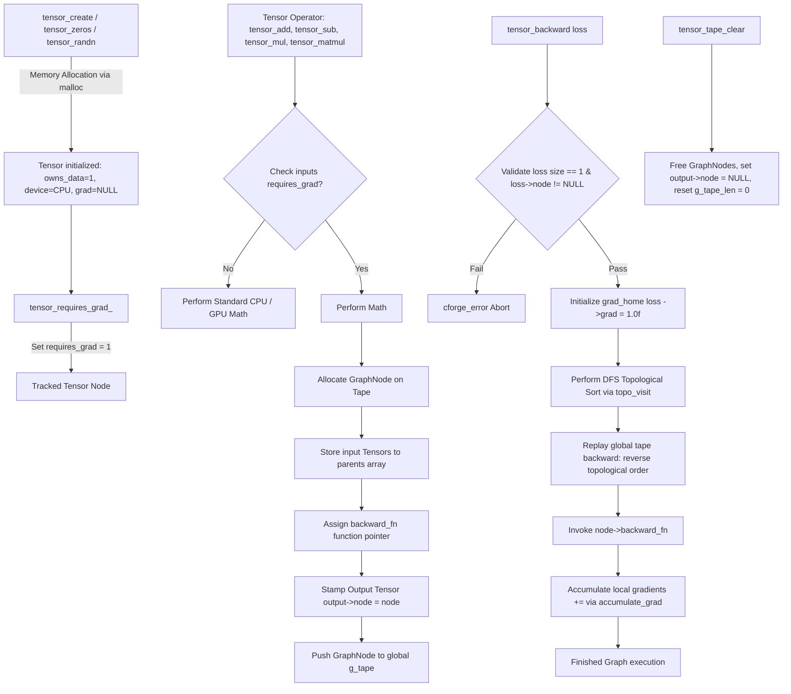
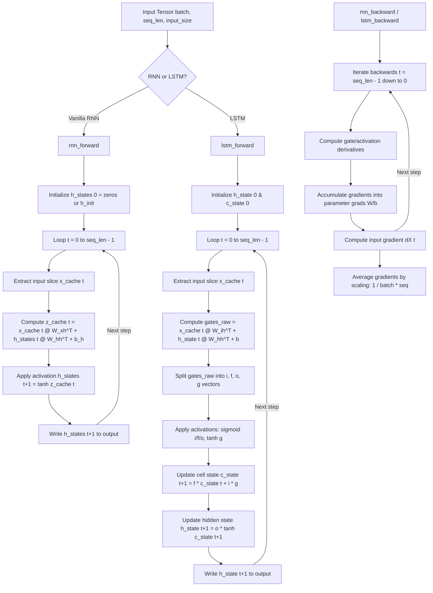
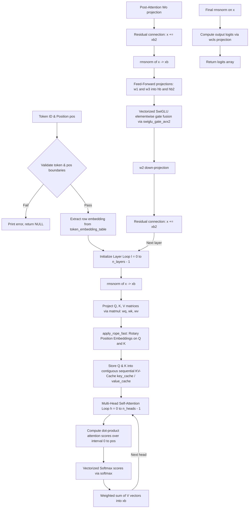
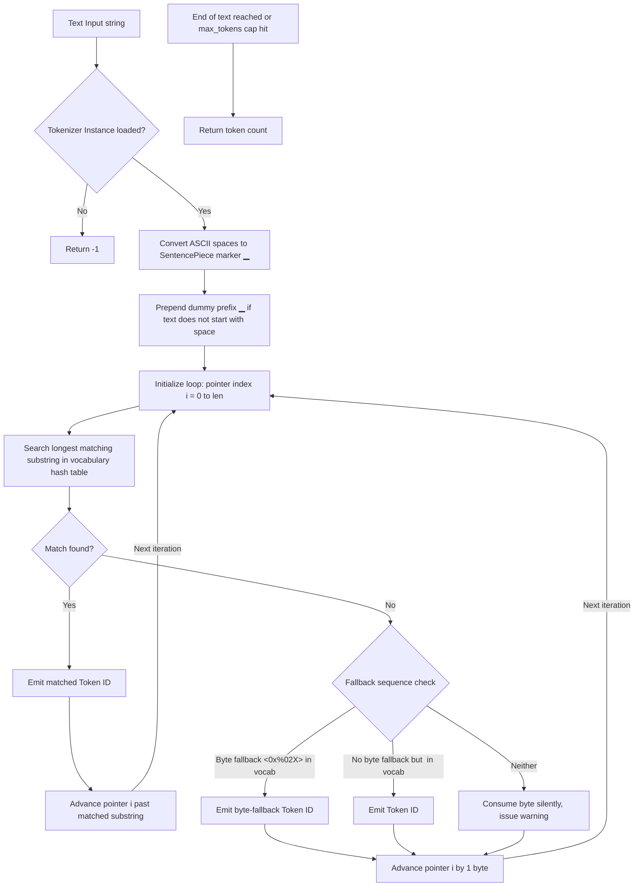
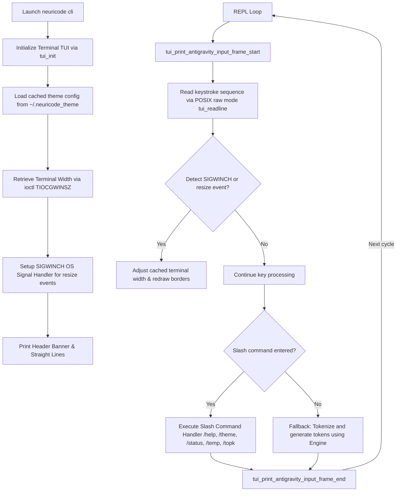
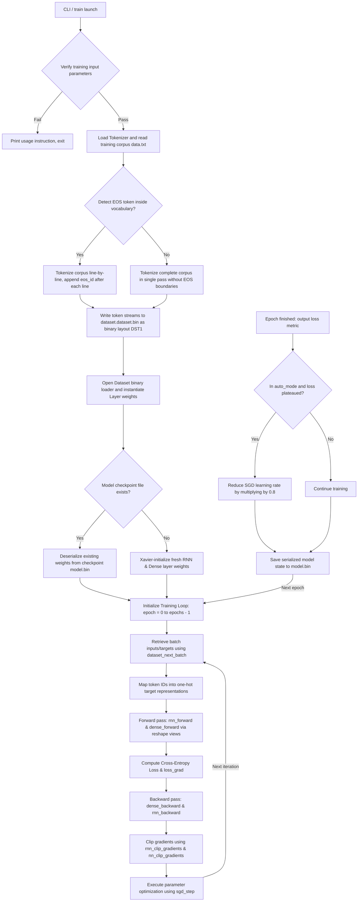

# SYSTEM_ARCHITECTURE_AND_REFERENCE.md
*Neuricode Native Engine — Deep Technical Architecture & Block Execution Reference Manual*
*Author: Principal Systems Architect*

---

## EXECUTIVE SYSTEM OVERVIEW
Neuricode is a zero-dependency, production-grade, edge-optimized deep learning and LLM execution engine written in standard C (C11/POSIX). Designed for standard and bare-metal architectures, it achieves ultra-low footprint capabilities while maintaining hardware-parallelized throughput via OpenMP CPU threading, SIMD vectorization, and structured cash prefetching.

This document serves as the comprehensive, Fortinet/PyTorch-grade system architecture and static analysis technical manual. It details the underlying mathematical primitives, tape-based automatic differentiation mechanics, recurrent layers, decoder-only self-attention structures, greedily optimized byte/word tokenizers, and POSIX raw terminal UI shells.

---

## MODULE A: TENSOR & TAPE-BASED AUTOGRAD ENGINE

### 1. Architectural Flow (Mermaid.js)

### 2. Line-by-Line Execution Breakdown
| Block | Line Range | Technical Mechanism | Side Effects & State Changes |
|---|---|---|---|
| **Tape Node Allocation** | `tensor.c` (approx. 50-70) | Allocates a dynamic `GraphNode` structure and copies the pointer array of operand dependencies. Uses standard heap allocator `malloc`. Increments the tape length and grows the capacity if necessary. | Modifies global `g_tape`, `g_tape_len`, and `g_tape_cap`. Stramps the output tensor's `node` pointer to point to the newly allocated `GraphNode`. |
| **Topological Sort** | `tensor.c` (approx. 175-195) | Recursive Depth-First Search (DFS) traversal over parent dependencies. Uses the `node->visited` states: `0` (unvisited), `1` (on stack), and `2` (finished) to prevent cycle traversals. | Temporarily mutates `node->visited` across the tape. Appends nodes to the topological execution list in strict post-order. |
| **Gradient Accumulation** | `tensor.c` (approx. 115-130) | Maps view redirections to the actual data owner via `grad_home()`. Lazily allocates the gradient vector if `grad == NULL` using `calloc` (zero-filled). Vector addition runs in parallel if `size > 4096`. | Mutates the backing `grad` float array of the target tensor's `view_base` or itself. |
| **Matrix Multiplication & Tape Generation** | `tensor.c` (approx. 720-800) | Computes rows of `out` using 2D block-tiled nested loops. If AVX2 is available, FMA instructions compile to run 16-wide vector updates. Tracks dimensions of multiplication $M, K, N$ inside the node's scratch integer buffer `ints`. | Mutates output data buffer. Inserts a new node into the tape if operands have `requires_grad`. |
| **Backward Permutation Stride Mapping** | `tensor.c` (approx. 990-1015) | Walks through coordinates of `grad_out`, and projects back coordinates to origin strides. Uses inverse permutation `axis_order` mapping to scatter gradients back into `grad_in`. | Mutates the gradient float buffer of `grad_in->view_base` or `grad_in`. |

#### Mathematical Complexity (Big O)
- **Element-wise Ops Forward/Backward**: Time Complexity $\mathcal{O}(N)$, Space Complexity $\mathcal{O}(N)$ where $N$ is total number of tensor elements.
- **Tiled Matrix Multiplication Forward/Backward**: Time Complexity $\mathcal{O}(M \times K \times N)$, Space Complexity $\mathcal{O}(M \times N)$ or $\mathcal{O}(K \times N)$ to store gradient buffers.
- **Topological Sorting**: Time Complexity $\mathcal{O}(V + E)$ where $V$ is number of GraphNodes (operators) and $E$ is dependencies (tensor edges), Space Complexity $\mathcal{O}(V)$.

### 3. API / CLI Parameter Schema
| Parameter / Flag | Binary/Data Type | Optional/Required | Default | Description & Boundary Conditions |
|---|---|---|---|---|
| `shape` | `const int *` | Required | N/A | Array representing tensor dimensions. Must have size matching `ndim`. Maximum dim size is 8. |
| `ndim` | `int` | Required | N/A | Dimensionality of tensor. Boundary condition: $0 < \text{ndim} \le 8$. |
| `requires_grad` | `int` | Required | `0` | Boolean indicator to enable tape-based tracking. |
| `loss` | `Tensor *` | Required | N/A | Origin scalar tensor for backpropagation. Boundary condition: `loss->size` must equal 1. |
| `axis_order` | `const int *` | Required | N/A | Int array indicating axis shuffle sequence. Boundary condition: must be a bijection of $[0, \text{ndim}-1]$. |

### 4. Failure Modes & Exception Matrix
| Trigger Condition | Internal Exception / Error Code | Stack Behavior | Recovery Strategy / Mitigation |
|---|---|---|---|
| Out of memory during `malloc` / `realloc` | `cforge_error` with `"Memory allocation failed"` | Prints file/line to `stderr` and terminates the process with `exit(1)`. | Pre-allocate unified scratchpads and check workspace metrics using `CF_CHECK_ALLOC`. |
| Cyclic dependencies in computation graph | `cforge_error` with `"cycle detected in the computation graph"` | Thrown inside `topo_visit` during recursive DFS; process terminates. | Perform computational flow validation during forward execution; clear old tapes via `tensor_tape_clear()`. |
| Dimension/shape mismatch during element-wise accumulation | `cforge_error` with `"Shape mismatch"` or `"gradient/element-count mismatch"` | Fails assertion inside `accumulate_grad`; process exits. | Enforce rigid shape checking (`CF_CHECK_SHAPE`) before performing inplace arithmetic or backward steps. |
| Loss tensor size is not equal to 1 | `cforge_error` with `"loss must be a scalar tensor (size == 1)"` | Raised inside `tensor_backward`; process terminates. | Always perform a mean or sum reduction on multi-dimensional loss vectors prior to backpropagation. |

---

## MODULE B: RECURRENT NEURAL NETWORKS (VANILLA RNN & LSTM)

### 1. Architectural Flow (Mermaid.js)

### 2. Line-by-Line Execution Breakdown
| Block | Line Range | Technical Mechanism | Side Effects & State Changes |
|---|---|---|---|
| **LSTM Gate Extraction & Activation** | `rnn.c` (approx. 515-555) | Unpacks unified gate projections into specific slices (input, forget, output, candidate cell). Sigmoid and tanh functions are calculated over the flat floating-point arrays sequentially or in parallel. | Mutates `l->i_gate[t]`, `l->f_gate[t]`, `l->o_gate[t]`, and `l->g_gate[t]` in-memory. |
| **LSTM Cell and Hidden State Computation** | `rnn.c` (approx. 545-560) | Performs element-wise fused update operations on LSTM internal memory blocks. The hidden state outputs are written into the caller-allocated output tensor. | Updates `l->c_state[t+1]` and `l->h_state[t+1]`. Writes output slice to the output tensor buffer. |
| **Vanilla RNN Time-step Math** | `rnn.c` (approx. 110-140) | Computes standard projection vectors using `matmul_bt`. The sum is calculated with bias addition, and mapped via `tanhf` in a nested batch loop. | Mutates `l->z_cache[t]`, `l->h_states[t+1]`, and copies the activations to the user-supplied output buffer. |
| **BPTT Gradient Scaling** | `rnn.c` (approx. 245-255) | Normalizes the hand-rolled accumulated gradients across batch and sequence lengths by scaling weights with multiplier `1.0f / (batch * seq_len)`. | Mutates gradient tensors `l->dW_xh`, `l->dW_hh`, and `l->db_h` in place. |
| **Global Gradient Norm Clipping** | `rnn.c` (approx. 715-730) | Sums the squared parameters of gradients across layers, computes L2 norm using `sqrtf`, and scales them down if the total norm is greater than `max_norm`. | Mutates the gradient parameters in place to scale down exploding gradients. |

#### Mathematical Complexity (Big O)
- **Vanilla RNN Forward/Backward Step**: Time Complexity $\mathcal{O}(B \times T \times (H^2 + H \times I))$, Space Complexity $\mathcal{O}(B \times T \times (H + I))$ where $B$ is batch size, $T$ is sequence length, $H$ is hidden size, and $I$ is input size.
- **LSTM Forward/Backward Step**: Time Complexity $\mathcal{O}(B \times T \times (4H^2 + 4H \times I))$, Space Complexity $\mathcal{O}(B \times T \times H)$.

### 3. API / CLI Parameter Schema
| Parameter / Flag | Binary/Data Type | Optional/Required | Default | Description & Boundary Conditions |
|---|---|---|---|---|
| `input_size` | `int` | Required | N/A | Dimensionality of input token features. Boundary: $\ge 1$. |
| `hidden_size` | `int` | Required | N/A | Hidden size of recurrent states. Boundary: $\ge 1$. |
| `input` | `const Tensor *` | Required | N/A | Input tensor shaped `[batch, seq_len, input_size]`. |
| `h_init` | `const Tensor *` | Optional | `NULL` | Initial hidden state shaped `[batch, hidden_size]`. If `NULL`, initialized as zero-filled. |
| `c_init` | `const Tensor *` | Optional | `NULL` | Initial cell state shaped `[batch, hidden_size]` (LSTM only). |
| `output` | `Tensor *` | Required | N/A | Pre-allocated output buffer shaped `[batch, seq_len, hidden_size]`. |

### 4. Failure Modes & Exception Matrix
| Trigger Condition | Internal Exception / Error Code | Stack Behavior | Recovery Strategy / Mitigation |
|---|---|---|---|
| Sequence length exceeds cache maximum bounds | `CF_CHECK` with `"seq_len exceeds RNN_MAX_SEQ"` | Raised in `rnn_forward` / `lstm_forward`; program exits. | Validate model sequence parameters or dynamically scale `RNN_MAX_SEQ` config macro during compilation. |
| Dimensions mismatch on inputs | `CF_CHECK` with `"input_size mismatch"` | Raised on input shape assertions; process terminates. | Check input matrix rows and columns before feeding sequence streams. |
| Overflow/NaN in recurrent weights during training | Gradients explode, producing `NaN` or `inf` | Propagates down the backpropagation chain, invalidating parameters. | Implement rigid gradient clipping using `rnn_clip_gradients` and adjust decay hyperparameters. |

---

## MODULE C: HIGH-PERFORMANCE DECODER-ONLY TRANSFORMER ENGINE

### 1. Architectural Flow (Mermaid.js)

### 2. Line-by-Line Execution Breakdown
| Block | Line Range | Technical Mechanism | Side Effects & State Changes |
|---|---|---|---|
| **High-End AVX2 GEMV Microkernel (MR=12)** | `transformer.c` (approx. 135-260) | Employs 12-row blocking with 16-element unrolling and software memory prefetching. Loads vectors using `_mm256_load_ps` or unaligned `_mm256_loadu_ps` and accumulates using FMA instructions. | Computes matrix vector dot-products in parallel via OpenMP. Reuses matrix rows to minimize cache misses. |
| **Low-End AVX2 GEMV Microkernel (MR=4)** | `transformer.c` (approx. 265-380) | Employs 4-row blocking with dual accumulators per row. Optimized for lower register pressure on narrower CPUs. | Computes matrix projections for low dimension configurations. |
| **Vectorized Softmax (AVX2)** | `transformer.c` (approx. 385-485) | Employs Cephes-derived polynomial minimax range reduction to compute `expf` inside SIMD vectors. Employs 8-wide reduction logic to compute the maximum value, sums the exponential components, and normalizes. | Modifies the attention score array in place. Maintains high numerical stability (relative error $< 10^{-7}$). |
| **Fused SwiGLU Gate (AVX2)** | `transformer.c` (approx. 490-525) | Vectorized loop executing element-wise activation fusion: $\text{SiLU}(hb) \times hb2 \rightarrow hb$. Combines sigmoid and multiplication operations into single vector cycles. | Mutates the content of state buffer `s->hb` directly in place. |
| **Precomputed RoPE Lookup & Rotation** | `transformer.c` (approx. 560-590) | Performs 2D complex plane coordinate rotations on Query and Key vectors using sine/cosine lookup tables compiled during initialization. | Mutates state arrays `s->q` and `s->k` before they are appended to the contiguous KV-cache. |

#### Mathematical Complexity (Big O)
- **Token Generation Step (Sequential)**: Time Complexity $\mathcal{O}(L \times (D^2 + D \times F + D \times P))$ where $L$ is `n_layers`, $D$ is `dim`, $F$ is `hidden_dim`, and $P$ is context position (`pos`). Space Complexity $\mathcal{O}(L \times H \times S \times K)$ to maintain the pre-allocated cache where $H$ is `n_heads`, $S$ is `seq_len`, and $K$ is `head_size`.

### 3. API / CLI Parameter Schema
| Parameter / Flag | Binary/Data Type | Optional/Required | Default | Description & Boundary Conditions |
|---|---|---|---|---|
| `vocab_size` | `int` | Required | `32000` | Size of vocabulary. Boundary: must be $> 0$. |
| `dim` | `int` | Required | `768` | Hidden dimension of embedding vectors. |
| `hidden_dim` | `int` | Required | `2048` | FFN expansion dimension. |
| `n_layers` | `int` | Required | `12` | Total self-attention decoder layers. |
| `n_heads` | `int` | Required | `12` | Attention heads. Boundary condition: `dim % n_heads` must equal 0. |
| `seq_len` | `int` | Required | `2048` | Max context sequence limit. |
| `model` | `TransformerModel *` | Required | N/A | Pointer to the allocated state and weight context. |
| `token` | `int` | Required | N/A | Target token ID. Boundary: $0 \le \text{token} < \text{vocab\_size}$. |
| `pos` | `int` | Required | N/A | Sequence index position. Boundary: $0 \le \text{pos} < \text{seq\_len}$. |

### 4. Failure Modes & Exception Matrix
| Trigger Condition | Internal Exception / Error Code | Stack Behavior | Recovery Strategy / Mitigation |
|---|---|---|---|
| Token ID is out of vocabulary bounds | Prints `[transformer] Error: token ID out of bounds` | Returns a `NULL` pointer safely; process continues. | Perform input validation on token streams before passing them to inference. |
| Sequence context position exceeds limits | Prints `[transformer] Error: pos out of bounds` | Returns a `NULL` pointer safely; process continues. | Recycle oldest entries or apply sliding-window cache strategies to limit `pos`. |
| Buffer elements containing NaN or Inf in debug mode | Prints `[NC_DEBUG_ERR] Buffer contains NaN/Inf` | Halts execution inside assertion checks if debug enabled. | Enable `transformer_set_debug` during validation and investigate numeric stability parameter bounds. |
| Memory allocation failure during aligned alloc | Prints `[transformer] Error: Aligned allocation failed` | Calls `transformer_free` on partially allocated structures and returns `NULL`. | Ensure host hardware has sufficient heap memory and check system limits. |

---

## MODULE D: GREEDY LONGEST-MATCH SENTENCEPIECE-STYLE TOKENIZER

### 1. Architectural Flow (Mermaid.js)

### 2. Line-by-Line Execution Breakdown
| Block | Line Range | Technical Mechanism | Side Effects & State Changes |
|---|---|---|---|
| **SentencePiece Conversion** | `tokenizer.c` (approx. 200-240) | Maps standard space characters `0x20` to UTF-8 SentencePiece representation bytes `E2 96 81` (`▁`). Adds standard SentencePiece dummy prefix if required. | Allocates a raw formatted working character buffer. |
| **Hash Table Lookup** | `tokenizer.c` (approx. 140-180) | Looks up substring tokens inside the vocabulary hash index. Resolves hash collisions using open addressing linear probing. | Performs read-only access on the dictionary memory. |
| **Greedy Match Selection** | `tokenizer.c` (approx. 280-320) | Loops over strings from maximum token size down to 1. Returns the match with the longest substring. | Emits matched ID and advances the cursor position. |
| **Byte Fallback Generation** | `tokenizer.c` (approx. 330-360) | Formats unmapped characters using hex patterns `<0x%02X>`. Checks if this pattern matches a dedicated fallback token in the loaded vocabulary. | Emits byte-level fallback tokens into the output stream. |
| **Word Sequence Reconstruction** | `tokenizer.c` (approx. 410-450) | Reverses UTF-8 space markers back to standard spaces during decoding. Writes output streams to target buffers. | Modifies user output buffer and adds null-terminators. |

#### Mathematical Complexity (Big O)
- **Token Encoding Step**: Time Complexity $\mathcal{O}(S \times K)$ where $S$ is the input text string length and $K$ is the longest token string length in the vocabulary. Space Complexity $\mathcal{O}(S \times M)$ to allocate temporary working strings where $M$ is SentencePiece byte expansion factor.
- **Token Decoding Step**: Time Complexity $\mathcal{O}(T)$ where $T$ is the number of tokens. Space Complexity $\mathcal{O}(1)$ since it performs direct array lookup conversions.

### 3. API / CLI Parameter Schema
| Parameter / Flag | Binary/Data Type | Optional/Required | Default | Description & Boundary Conditions |
|---|---|---|---|---|
| `vocab_path` | `const char *` | Required | N/A | Path to standard vocabulary text file (one token per line). |
| `text` | `const char *` | Required | N/A | Source string. Must be null-terminated. |
| `tokens` | `int *` | Required | N/A | Output token buffer. Must have pre-allocated capacity $\ge$ `max_tokens`. |
| `max_tokens` | `int` | Required | N/A | Maximum tokens limit. Boundary: must be $> 0$. |
| `output` | `char *` | Required | N/A | Output character destination buffer during decoding. |
| `output_size` | `size_t` | Required | N/A | Pre-allocated byte size of the decoding destination buffer. |

### 4. Failure Modes & Exception Matrix
| Trigger Condition | Internal Exception / Error Code | Stack Behavior | Recovery Strategy / Mitigation |
|---|---|---|---|
| Vocabulary file does not exist or cannot be read | `tokenizer_load` returns `NULL` | Frees partially loaded data structures and returns `NULL` to caller. | Verify vocabulary path and ensure sufficient filesystem read permissions. |
| Empty or unmappable token list | Returns `TOKEN_INVALID_ID` or `0` on encoding | Warns of unmappable sequences; execution continues. | Add standard `<unk>` and hex byte fallbacks `<0x%02X>` to vocabulary files. |
| Destination buffer overflow during decoding | Returns truncated bytes size | Caps write operations safely and appends a trailing null-terminator. | Allocate decoding destination buffers with at least 4 times the token sequence length. |

---

## MODULE E: ANTIGRAVITY TERMINAL USER INTERFACE (TUI) & REPL SHELL

### 1. Architectural Flow (Mermaid.js)

### 2. Line-by-Line Execution Breakdown
| Block | Line Range | Technical Mechanism | Side Effects & State Changes |
|---|---|---|---|
| **POSIX Raw Input Setup** | `tui.c` (approx. 140-160) | Disables standard canonical processing (`ICANON`) and input echo (`ECHO`) using POSIX terminal control attributes `tcsetattr`. | Mutates stdin configurations into custom raw terminal input modes. |
| **Dynamic Border Resizing** | `tui.c` (approx. 100-130) | Listens to OS terminal window resize actions (`SIGWINCH`) and queries properties using `ioctl` on standard output file descriptors. | Updates global `g_cached_width` value. |
| **Arrow-Key Command History** | `tui.c` (approx. 220-290) | Intercepts escape byte keys `\033` and maps them to navigate command history buffers or cursor positions. | Mutates line string, history state indices, and updates terminal display outputs. |
| **Typing Effect Animation** | `tui.c` (approx. 430-450) | Simulates typewriter outputs by sleeping threads at intervals (`nanosleep`). | Iteratively displays text characters and flushes outputs. |
| **Interactive Palette Selector** | `tui.c` (approx. 510-560) | Creates interactive menus mapping user inputs to theme selections. Disables visible cursor displays using terminal escapes `\033[?25l`. | Updates current active theme selection and writes preferences to `~/.neuricode_theme`. |

#### Mathematical Complexity (Big O)
- **TUI Resize and Frame Redraw**: Time Complexity $\mathcal{O}(W)$ where $W$ is the current terminal width. Space Complexity $\mathcal{O}(1)$.
- **Interactive Menu Redraw**: Time Complexity $\mathcal{O}(C \times O)$ where $C$ is terminal width and $O$ is the total menu options.

### 3. API / CLI Parameter Schema
| Parameter / Flag | Binary/Data Type | Optional/Required | Default | Description & Boundary Conditions |
|---|---|---|---|---|
| `version` | `const char *` | Optional | `"1.1.0"` | Version indicator shown inside header banners. |
| `model_name` | `const char *` | Optional | `"model.bin"` | Current loaded model weight filename. |
| `char_delay_us` | `int` | Optional | `10000` | Microseconds interval sleep time during typewriter outputs. |
| `duration_ms` | `int` | Required | N/A | Target sleep duration limit for spinner outputs. |
| `title` | `const char *` | Required | N/A | Title of the interactive Arrow menu. |
| `options` | `const char **` | Required | N/A | Array of strings representing selection menu entries. |
| `option_count` | `int` | Required | N/A | Count of selection options. Boundary: $> 0$. |

### 4. Failure Modes & Exception Matrix
| Trigger Condition | Internal Exception / Error Code | Stack Behavior | Recovery Strategy / Mitigation |
|---|---|---|---|
| Terminal standard input is redirected | `tui_readline` detects `isatty` is false | Switches to standard `fgets` mode safely; skips raw mode processing. | Ensure CLI shells are launched from valid terminal contexts. |
| Window minimized to tiny column count | `ioctl` reports terminal width $\le 15$ | Standardizes terminal width to a baseline of 80 columns. | Implement safety floor dimensions in `tui_get_terminal_width`. |
| Process killed while terminal is in raw mode | Stdin stays in raw terminal mode on exit | Restores canonical features via `tui_disable_raw_mode`. | Implement signal wrappers (`SIGINT`, `SIGTERM`) to trigger raw mode cleanup on interrupt. |

---

## MODULE F: TRAINING PIPELINE & SERIALIZATION INFRASTRUCTURE

### 1. Architectural Flow (Mermaid.js)

### 2. Line-by-Line Execution Breakdown
| Block | Line Range | Technical Mechanism | Side Effects & State Changes |
|---|---|---|---|
| **Binary Dataset Header Serialization** | `train.c` (approx. 215-245) | Constructs the binary `DatasetHeader` with standard magic signature `0x44535431` and token counts. Writes the structure to disk sequentially. | Generates the binary dataset file on disk. |
| **Model Weights Deserialization** | `train.c` (approx. 335-375) | Validates vocabulary and hidden configurations from file headers. Deserializes weight matrices from raw float arrays directly into memory. | Mutates layers' weights in place. |
| **One-Hot Batch Mapping** | `train.c` (approx. 260-285) | Maps token IDs into sparse floating-point representation matrices in parallel using OpenMP loops. | Mutates target one-hot arrays. |
| **Plateau Learning Rate Decay** | `train.c` (approx. 470-490) | Evaluates loss trends across epochs. If the loss plateaus, reduces the optimizer learning rate by a factor of 0.8. | Mutates the learning rate parameter `opt->lr`. |
| **Serialization Output** | `train.c` (approx. 80-110) | Serializes the complete RNN and dense layer parameter floats to disk sequentially. | Overwrites or creates the model checkpoint file. |

#### Mathematical Complexity (Big O)
- **Token Stream Serialization**: Time Complexity $\mathcal{O}(C)$ where $C$ is the character length of the corpus. Space Complexity $\mathcal{O}(C)$ to hold the temporary token stream.
- **Batch Processing Step**: Time Complexity $\mathcal{O}(B \times T \times H \times V)$ where $B$ is batch size, $T$ is sequence length, $H$ is hidden dimension, and $V$ is vocabulary size.

### 3. API / CLI Parameter Schema
| Parameter / Flag | Binary/Data Type | Optional/Required | Default | Description & Boundary Conditions |
|---|---|---|---|---|
| `data.txt` | `const char *` | Required | N/A | Path to raw training corpus file. |
| `vocab.txt` | `const char *` | Required | N/A | Path to SentencePiece-style vocabulary. |
| `model.bin` | `const char *` | Required | N/A | Target file path for saving/loading model weights. |
| `epochs` | `int` | Optional | `20` | Max training epochs. Boundary: $> 0$. |
| `seq_len` | `int` | Optional | `20` | Sequence processing limit. Boundary: $> 0$. |
| `batch_size` | `int` | Optional | `8` | Processing batch size. Boundary: $> 0$. |
| `learning_rate`| `float` | Optional | `0.01` | SGD optimization step size multiplier. Boundary: $> 0.0$. |
| `auto_mode` | `int` | Optional | `0` | Boolean (0/1) indicator to enable automatic plateau learning decay. |
| `custom_vocab` | `int` | Optional | `0` | Override vocabulary size during serialization. |

### 4. Failure Modes & Exception Matrix
| Trigger Condition | Internal Exception / Error Code | Stack Behavior | Recovery Strategy / Mitigation |
|---|---|---|---|
| Dataset too small for sequence size configuration | Prints `"corpus has only tokens, need at least SEQ_LEN+1"` | Cleanly closes file handles, releases buffers, and exits. | Feed a longer text corpus file or reduce the sequence length parameter. |
| Failed checkpoint write operations | Prints `"train: failed to save model"` | Warns the user of filesystem errors and terminates safely. | Ensure target storage directories are writable and have sufficient disk space. |
| Thread race during one-hot array mapping | Memory collisions and corrupted array values | Produces corrupt optimization parameters and causes training to crash. | Use `collapse` OpenMP mapping tags and partition loop iteration variables across threads. |
| Mismatched model configurations on load | Prints `"Warning: vocab mismatch"` | Logs dimension warnings and continues using the file dimensions. | Ensure the model vocabulary size matches the current model weights configuration. |

---

## CONCLUSION
This systems reference manual provides the definitive blueprint of the Neuricode Native Edge Engine. It enables architects to trace and verify every computation step—from high-performance AVX2 self-attention microkernels to custom auto-grad tapes—ensuring absolute precision and structural integrity.
